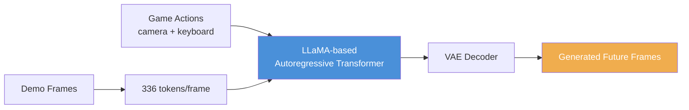

# MineWorld-Enhancement

> **面向实时交互世界模型的推理代价诊断**：对角线解码（Diagonal Decoding）的精确测速、投机解码（Speculative Decoding）的系统研究，以及一个明确的边界刻画——推理技巧无法跨越的边界在哪里，跨越它需要回到训练层。

[](https://arxiv.org/pdf/2504.08388) &ensp; [](https://github.com/microsoft/mineworld) &ensp; [](LICENSE)

---

## 📄 论文

本仓库的完整研究已整理为论文（`paper/main.tex`，可直接编译为 PDF）：

> **The Inference Cost of Diagonal Decoding in Autoregressive World Models: Measuring the Boundary and Why Inference-Time Tricks Cannot Cross It**

核心结论（均有实测数据支撑）：

1. **代价的精确构成**：对角线解码每步 $\sim$9 ms GPU kernel 时间，其中 flash-attention 占 77%，且严格线性于层数（0.45 ms/层），与每步解码的 token 数无关。
2. **推理技巧无法突破**：投机解码（达到 $1.012\times$ parity）、KV 裁剪、xformers、window 调参、块级并行、多卡放置，全部无效。
3. **帧内因果是 learned necessity**：一次性帧级并行解码达 $43.5$ FPS（$15.7\times$）但 token 准确率归零（teacher-forcing 下亦然）。

---

## 🎯 项目简介

MineWorld 是一个 **视觉-动作自回归世界模型**：输入若干游戏画面帧与玩家动作（键盘 + 鼠标），模型预测游戏世界的演化，逐帧生成未来画面。一帧画面被 VQ-VAE 编码为 $14\times24=336$ 个离散 token。

原版通过 **Diagonal Decoding（对角线解码）** 利用 2-D 空间依赖，把每帧的 336 步串行前向压缩到 33 步（14+24-1=37 条对角线，窗口调度合并到 33）。本仓库在此基础上：

1. **实现帧级投机解码**（`inference/inference_speculative.py`）——小模型一次前向提议整帧，动作验证决定接受/回退；
2. **系统测量推理代价**——CUDA event + kernel 级 profiling，定位 $\sim$9 ms/步的构成；
3. **刻画加速边界**——穷举推理侧优化后，指出真正的前进方向是训练时的因果结构（2-D block causal）。



---

## 🚀 核心组件

| 组件 | 文件 | 说明 |
|------|------|------|
| 标准推理（对角线解码） | `inference/inference.py` | 原版对角线解码入口 |
| **投机解码推理** | `inference/inference_speculative.py` | 帧级投机，Main/Spec 双流 + 动作验证 |
| 草稿模型 + 动作预测器 | `util/speculative_wrapper.py` | `AttentionTokenPredictor`（13.9M）+ 2 层 GRU |
| 对角线 + 投机调度 | `diagonal_decoding.py` | 状态机、窗口调度、容错验证 |
| 世界模型 | `lvm.py` | LLaMA 架构 + 旋转位置编码 + GQA 注意力 |
| 深度感知草稿模型定义 | `util/attn_model.py` | ResNet + 动作 MLP + 交叉注意力 |
| 动作预测器训练 | `train_action_predictor.py` | 2 层 GRU，top-K 候选 |
| 草稿模型训练 | `training/train_uncertainty.py` | 深度 + 置信度（uncertainty loss） |

### 关键设计：容错动作验证

投机解码的接受机制不是"全对才接受"。键盘动作必须精确匹配，但相机 yaw/pitch 允许在 $\tau$ 个量化 bin 内偏差（默认 $\tau=2$，环境变量 `CAM_TOL` 可调）——小相机偏差产生近乎相同的帧，容错验证大幅提升接受率。

---

## 📊 关键实验结果

### 端到端（197 个配对 clip，RTX 3090）

| 方法 | 平均 FPS | 中位 FPS | PSNR (20 clips) |
|------|---------|---------|-----------------|
| 对角线解码（baseline） | 2.675 ± 0.096 | 2.753 | 17.19 |
| 帧级投机（本仓库） | 2.702 ± 0.149 | 2.730 | 15.65 |
| **加速比** | **1.012×** | **1.024×** | −1.54 dB |

### 推理代价拆解（每步 decode）

| 组件 | GPU 时间 | 占比 |
|------|---------|------|
| Flash attention (FMHA) | 6.9 ms | 77% |
| 融合 GEMM（MLP + 投影） | 1.4 ms | 16% |
| 其他（elementwise/reduction） | 0.7 ms | 7% |

### 被排除的推理侧优化（论文 Table 3）

| 优化方向 | 结果 | 原因 |
|---------|------|------|
| 投机解码 | 1.012× parity | 瓶颈在 per-step 成本，非 draft |
| KV cache 裁剪 | 无收益 | 15 帧推理时 cache 填充到 99% |
| xformers | 慢 4.5× | SDPA flash attention 已最优 |
| window 调参 (2/4/8) | 无变化 | 步数固定 33 |
| 块级并行 | 不减少步数 | 块内串行冗余 |
| 多卡放置 | 无变化 | 无 contention 可缓解 |

---

## 🔧 快速开始

### 环境
```bash
conda create -n mineworld python=3.10
conda activate mineworld
pip install -r requirements.txt
```

### 标准推理（对角线解码）
```bash
python inference/inference.py \
    --data_root "small_validation" \
    --model_ckpt "checkpoints/300M_16f.ckpt" \
    --config "configs/modify.yaml" \
    --accelerate-algo "image_diagd" \
    --frames 15 --top_p 0.8 \
    --output_dir "outputs_video/"
```

### 投机解码推理
```bash
python inference/inference_speculative.py \
    --data_root "small_validation" \
    --model_ckpt "checkpoints/300M_16f.ckpt" \
    --config "configs/modify.yaml" \
    --frames 15 --top_p 0.8 \
    --output_dir "outputs_video/" \
    --action_model_ckpt "pred_model/action_predictor_latest.pth" \
    --draft_model_ckpt "pred_model_uncertainty/best_model.pth" \
    [--use_oracle]   # 可选：GT oracle 验证 workflow 正确性
```

> 注意：首次运行会触发 `torch.compile` 编译（约 1 分钟）；第 2 个 demo 才是预热后的真实速度。

### 训练
```bash
# 动作预测器
python train_action_predictor.py --data_root ... --output_dir ...

# 深度感知草稿模型
python training/train_uncertainty.py --data_root ... --output_dir ...
```

---

## 📁 项目结构

```
mineworld-enhancement/
├── inference/                    # 推理入口
│   ├── inference.py              #   标准推理（对角线解码）
│   ├── inference_speculative.py  #   投机解码推理
│   ├── infer_with_guess.py       #   猜测采样推理
│   ├── infer.sh                  #   推理脚本
│   └── ...
│
├── diagonal_decoding.py          # 对角线 + 投机解码调度
├── lvm.py                        # LLaMA 世界模型
├── token_sampler.py              # token 空间几何采样
├── mcdataset.py                  # Minecraft 数据集辅助
├── vae.py                        # VQ-VAE tokenizer 封装
├── train.py                      # 主模型训练（含训练数据构造）
├── train_action_predictor.py     # 动作预测器训练
│
├── training/                     # 草稿模型等训练脚本
│   ├── train_uncertainty.py      #   深度 + 置信度草稿模型
│   ├── train_misalignment_predictor.py
│   ├── train_pred_with_attn.py
│   └── ...
│
├── evaluation/                   # 质量评估脚本
│   ├── eval_pred_video_modes.py  #   FVD/LPIPS/SSIM/PSNR
│   ├── eval_depth_sensitivity.py
│   └── verify_neighbor_robustness.py
│
├── scripts/                      # 实验/绘图/统计脚本
│   ├── run_exp.sh                #   测速实验脚本
│   └── ...
│
├── util/                         # 模型与工具
│   ├── speculative_wrapper.py    #   草稿模型 + 动作预测器包装
│   ├── attn_model.py             #   AttentionTokenPredictor
│   ├── DepthAnythingWrapper.py   #   深度估计封装
│   └── ...
├── tools/                        # token 空间分析工具集
├── configs/                      # 模型配置
├── checkpoints/                  # 预训练权重（不入库）
├── paper/                        # 📄 论文（LaTeX 源码 + PDF）
└── docs/                         # 优化记录与技术文档
```

---

## 📄 License

本项目基于 [MineWorld](https://github.com/microsoft/mineworld)（MIT License）。新增代码沿用同一许可证。

## 🙏 致谢

- [MineWorld](https://github.com/microsoft/mineworld)：基础世界模型与对角线解码
- [DepthAnything](https://github.com/DepthAnything/Depth-Anything-V2)：深度估计模型
- 感谢 Yunbo Wang 老师与 Jiajian Li 学长提供的资源与思路支持
