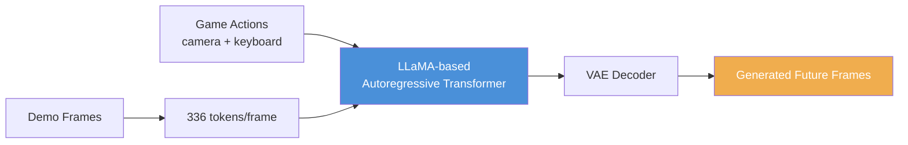
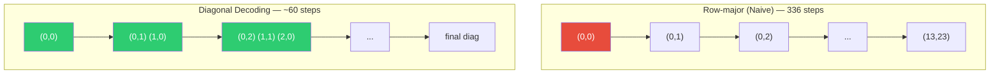
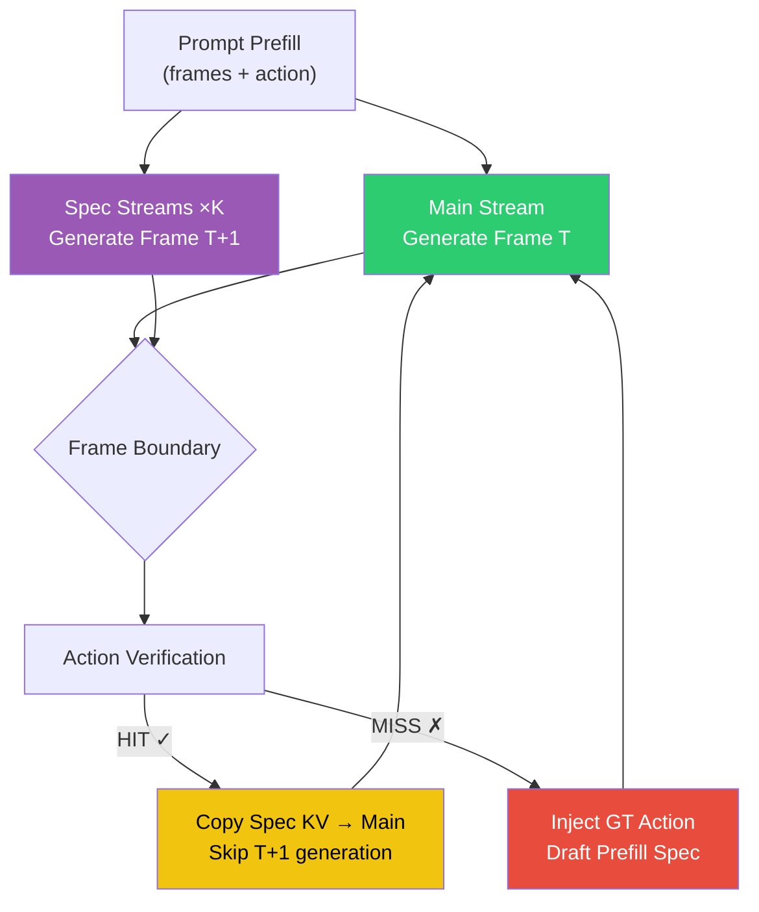
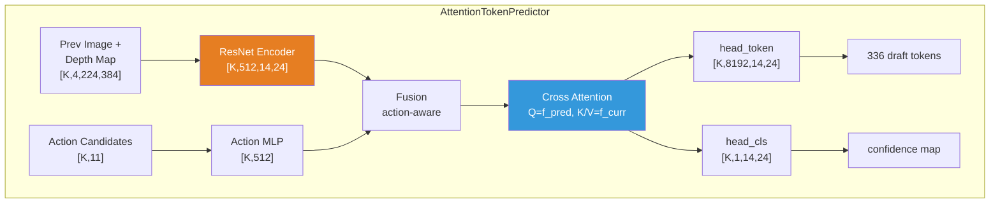
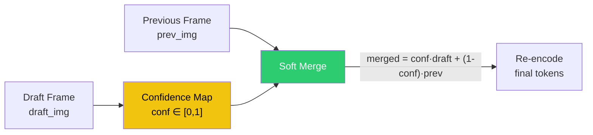

# MineWorld-Enhancement

> 🚀 **面向 MineWorld 的推理加速与增强**：推测解码（Speculative Decoding）+ 深度感知草稿模型（Depth-Aware Draft Model）+ 系统化评估
>
> 基于 [MineWorld](https://github.com/microsoft/mineworld)（一个 Minecraft 实时交互世界模型），本仓库聚焦于**推理速度**与**生成质量**的进一步突破。

[](https://arxiv.org/pdf/2504.08388) &ensp; [](https://github.com/microsoft/mineworld) &ensp; [](LICENSE)

---

## ✨ 核心贡献

在原版 MineWorld 之上，本仓库实现了三项关键增强：

| # | 增强方向 | 核心文件 | 说明 |
|---|---------|---------|------|
| 1 | **推测解码** | `inference_speculative.py`、`speculative_wrapper.py`、`diagonal_decoding.py` | 在对角解码之上叠加投机采样，Main/Spec 双流并行 |
| 2 | **深度感知草稿模型** | `util/attn_model.py`、`train_uncertainty.py` | 引入深度图先验的 `AttentionTokenPredictor`，一次性预测整帧 336 token |
| 3 | **置信度软合并（容错）** | `speculative_wrapper.py`、`train_uncertainty.py` | 逐 token 置信度门控，低置信度区域回退到上一帧，允许"部分 MISS" |

---

## 🏗️ 背景：MineWorld 是什么

MineWorld 是一个 **视觉-动作自回归世界模型**：输入若干游戏画面帧与玩家动作（键盘 + 鼠标），模型预测游戏世界的演化，逐帧生成未来画面。



原版的推理瓶颈在于**自回归逐 token 生成**：一帧 14×24 = 336 个像素 token，需要 336 次串行前向。原版通过 **Diagonal Decoding（对角解码）** 将步数降到约 60 步，达到 4–7 FPS。

> **对角线解码**：不按行、而按对角线顺序生成 token，一次前向可并行预测对角线上的多个 token。



---

## 🚀 增强一：推测解码（Speculative Decoding）

### 核心思想

在对角解码基础上，引入**双流并行**：Main 流生成当前帧，K 个 Spec 流同时猜测下一帧。在帧边界通过**动作验证**决定接受（HIT）或回退（MISS）。



> **关于"部分 MISS"**：草稿模型的输出并非「全对才接受」。每一帧的草稿 token 都附带置信度，低置信度的 token 在图像空间与上一帧做**软合并**（soft merge）——即"部分预测对了就部分接受，拿不准的地方回退上一帧"。这大幅提升了草稿的可用率，避免整帧被丢弃。

### 关键组件

| 组件 | 实现 | 说明 |
|------|------|------|
| **动作预测器** | `train_action_predictor.py` | 2 层 GRU，输入历史动作序列，beam search 输出 top-K 候选动作 |
| **草稿模型** | `util/attn_model.py`（`AttentionTokenPredictor`） | ResNet 视觉编码器 + 动作 MLP + 交叉注意力，**一次前向预测整帧 336 token** |
| **双流调度** | `diagonal_decoding.py` | `speculative_img_diagd_decode_n_tokens` 状态机 |

### 草稿模型架构



---

## 📊 增强二：深度感知与几何分析

草稿模型的视觉输入拼接了 **DepthAnything** 深度图，为预测提供几何先验。配套实现了一系列 token 空间几何分析工具：

| 工具 | 作用 |
|------|------|
| `token_sampler.py` | token 网格上的空间角度采样（`SpatialAngleSampler`），将 yaw/pitch 映射到 token 邻居 |
| `tools/analyze_token_angles.py` | 分析 token 间的相机角度关系 |
| `tools/analyze_shift_neighbors.py` | 分析平移（shift）邻居 |
| `tools/analyze_depth_misalignment.py` | 深度图与视觉 token 的错位分析 |
| `train_misalignment_predictor.py` | 训练错位预测器 |

---

## 🎯 增强三：置信度软合并（容错接受）

推测解码的传统做法是「草稿全对才接受，否则整段丢弃」。这在实际中过于苛刻——草稿模型很难一次性精确预测整帧 336 个 token。

本仓库采用 **逐 token 置信度门控的软合并**：



- **高置信度 token**：采纳草稿的预测
- **低置信度 token**：回退到上一帧的对应像素
- **效果**：草稿「部分正确就部分接受」，拿不准的地方自动回退，避免整帧草稿被浪费

| 实现点 | 位置 |
|--------|------|
| 置信度头 `head_cls` | `util/attn_model.py` |
| 置信度训练（uncertainty loss） | `train_uncertainty.py` |
| 图像空间软合并 | `speculative_wrapper.py` → `draft_func(merge=True)` |

---

## 📈 评估结果

采用 FVD / LPIPS / SSIM / PSNR 四项指标，对比 Teacher Forcing 与自回归生成：

| 模式 | FVD ↓ | LPIPS ↓ | SSIM ↑ | PSNR ↑ |
|------|-------|---------|--------|--------|
| Teacher Forcing | 402.4 | 0.140 | 0.616 | 23.78 |
| Autoregressive | 1571.0 | 0.621 | 0.465 | 14.64 |

> 完整评估代码见 `eval_pred_video_modes.py`，深度敏感性分析见 `eval_depth_sensitivity.py`，邻居鲁棒性见 `verify_neighbor_robustness.py`。

---

## 🔧 快速开始

### 环境
```bash
conda create -n mineworld python=3.10
conda activate mineworld
pip install -r requirements.txt
```

### 标准推理（对角线解码）
```bash
python inference.py \
    --data_root "small_validation" \
    --model_ckpt "checkpoints/300M_16f.ckpt" \
    --config "configs/modify.yaml" \
    --accelerate-algo "image_diagd" \
    --frames 15 --top_p 0.8 \
    --output_dir "outputs_video/"
```

### 推测解码推理
```bash
python inference_speculative.py \
    --data_root "small_validation" \
    --model_ckpt "checkpoints/300M_16f.ckpt" \
    --config "configs/modify.yaml" \
    --frames 15 --top_p 0.8 \
    --output_dir "outputs_video/" \
    --action_model_ckpt "pred_model/action_predictor_latest.pth" \
    --draft_model_ckpt "pred_model_uncertainty/best_model.pth" \
    [--use_oracle]   # 可选：用 GT oracle 验证 workflow 正确性
```

### 训练
```bash
# 动作预测器
python train_action_predictor.py --data_root ... --output_dir ...

# 深度感知草稿模型
python train_uncertainty.py --data_root ... --output_dir ...
```

---

## 📁 项目结构

```
mineworld-enhancement/
├── inference.py                # 标准推理（对角线解码）
├── inference_speculative.py    # 🆕 推测解码推理入口
├── speculative_wrapper.py      # 🆕 草稿模型 + 动作预测器包装
├── diagonal_decoding.py        # ✏️ 对角线解码 + 投机解码调度
├── lvm.py                      # ✏️ LLaMA 世界模型（新增投机生成接口）
├── token_sampler.py            # 🆕 token 空间几何采样
├── train_action_predictor.py   # 🆕 动作预测器训练
├── train_uncertainty.py        # 🆕 草稿模型训练（深度 + 置信度）
├── train_pred_with_attn.py     # 🆕 注意力草稿模型训练（早期版本）
├── train_misalignment_predictor.py  # 🆕 错位预测器训练
├── eval_pred_video_modes.py    # 🆕 视频质量评估（FVD/LPIPS/SSIM/PSNR）
├── eval_depth_sensitivity.py   # 🆕 深度敏感性分析
├── verify_neighbor_robustness.py    # 🆕 邻居鲁棒性验证
├── util/
│   ├── attn_model.py           # 🆕 AttentionTokenPredictor（草稿模型）
│   ├── DepthAnythingWrapper.py # 🆕 深度估计封装
│   ├── neighbor_loss.py        # 🆕 邻居一致性损失
│   └── ...
├── tools/                      # 🆕 token 空间分析工具集
├── configs/                    # 模型配置
└── checkpoints/                # 预训练权重（不入库）
```

---

## 📄 License

本项目基于 [MineWorld](https://github.com/microsoft/mineworld)（MIT License）。新增代码沿用同一许可证。

## 🙏 致谢

- [MineWorld](https://github.com/microsoft/mineworld)：基础世界模型与对角线解码
- [VPT](https://github.com/openai/Video-Pre-Training)、[generative-models](https://github.com/Stability-AI/generative-models)：基础代码借鉴
- [DepthAnything](https://github.com/DepthAnything/Depth-Anything-V2)：深度估计模型
